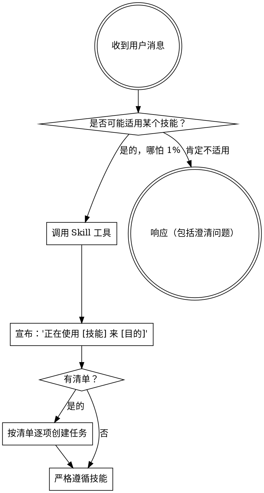

# Fuxian 插件实现计划

> **For agentic workers:** REQUIRED SUB-SKILL: Use superpowers:subagent-driven-development (recommended) or superpowers:executing-plans to implement this plan task-by-task. Steps use checkbox (`- [ ]`) syntax for tracking.

**Goal:** 创建一个面向自研芯片编译器开发的 Claude Code / opencode 技能插件基础仓库。

**Architecture:** 基于 superpowers 的精简克隆方案。使用 `.claude-plugin` 注册插件，SessionStart 钩子自动注入引导技能上下文，skills 目录存放中文编写的 SKILL.md 技能文件。opencode 通过 JS 插件入口加载技能。

**Tech Stack:** Bash (hooks), JavaScript ES Module (opencode plugin), Markdown (skills)

---

## 文件清单

| 文件 | 职责 |
|------|------|
| `.claude-plugin/plugin.json` | 插件元数据（名称、版本、描述） |
| `.claude-plugin/marketplace.json` | 本地开发市场配置 |
| `.opencode/plugins/fuxian.js` | opencode 插件入口，注入引导上下文+注册技能路径 |
| `hooks/hooks.json` | SessionStart 钩子定义 |
| `hooks/session-start` | bash 脚本，读取引导技能并注入 JSON 上下文 |
| `hooks/run-hook.cmd` | Windows cmd/bash 跨平台执行器 |
| `skills/using-fuxian/SKILL.md` | 引导技能：技能发现、优先级规则、红灯信号表 |
| `skills/using-fuxian/references/opencode-tools.md` | opencode 工具映射参考 |
| `skills/brainstorming/SKILL.md` | 头脑风暴技能：需求探索→设计方案 |
| `skills/test-driven-development/SKILL.md` | TDD 技能：红绿重构循环，编译器测试指导 |
| `skills/systematic-debugging/SKILL.md` | 系统调试技能：结构化调试流程 |
| `CLAUDE.md` | AI 代理贡献指南 |
| `README.md` | 项目介绍和安装说明 |
| `.gitignore` | Git 忽略规则 |
| `LICENSE` | MIT 许可证 |
| `package.json` | npm 包元数据 |

---

### Task 1: 项目骨架文件

**Files:**
- Create: `package.json`
- Create: `.gitignore`
- Create: `LICENSE`

- [ ] **Step 1: 创建 package.json**

```json
{
  "name": "fuxian",
  "version": "0.1.0",
  "type": "module",
  "main": ".opencode/plugins/fuxian.js"
}
```

- [ ] **Step 2: 创建 .gitignore**

```
.worktrees/
.private-journal/
.claude/
.DS_Store
node_modules/
```

- [ ] **Step 3: 创建 LICENSE（MIT）**

```
MIT License

Copyright (c) 2026 MrLau

Permission is hereby granted, free of charge, to any person obtaining a copy
of this software and associated documentation files (the "Software"), to deal
in the Software without restriction, including without limitation the rights
to use, copy, modify, merge, publish, distribute, sublicense, and/or sell
copies of the Software, and to permit persons to whom the Software is
furnished to do so, subject to the following conditions:

The above copyright notice and this permission notice shall be included in all
copies or substantial portions of the Software.

THE SOFTWARE IS PROVIDED "AS IS", WITHOUT WARRANTY OF ANY KIND, EXPRESS OR
IMPLIED, INCLUDING BUT NOT LIMITED TO THE WARRANTIES OF MERCHANTABILITY,
FITNESS FOR A PARTICULAR PURPOSE AND NONINFRINGEMENT. IN NO EVENT SHALL THE
AUTHORS OR COPYRIGHT HOLDERS BE LIABLE FOR ANY CLAIM, DAMAGES OR OTHER
LIABILITY, WHETHER IN AN ACTION OF CONTRACT, TORT OR OTHERWISE, ARISING FROM,
OUT OF OR IN CONNECTION WITH THE SOFTWARE OR THE USE OR OTHER DEALINGS IN THE
SOFTWARE.
```

- [ ] **Step 4: 提交**

```bash
git add package.json .gitignore LICENSE
git commit -m "初始化项目骨架文件"
```

---

### Task 2: 插件注册文件

**Files:**
- Create: `.claude-plugin/plugin.json`
- Create: `.claude-plugin/marketplace.json`

- [ ] **Step 1: 创建 .claude-plugin/plugin.json**

```json
{
  "name": "fuxian",
  "description": "自定义 AI 编码技能库：面向自研芯片编译器开发的 TDD、调试和协作最佳实践",
  "version": "0.1.0",
  "author": {
    "name": "MrLau"
  },
  "license": "MIT",
  "keywords": [
    "skills",
    "compiler",
    "tdd",
    "debugging",
    "fuxian"
  ]
}
```

- [ ] **Step 2: 创建 .claude-plugin/marketplace.json**

```json
{
  "name": "fuxian-dev",
  "description": "Development marketplace for Fuxian skills library",
  "owner": {
    "name": "MrLau"
  },
  "plugins": [
    {
      "name": "fuxian",
      "description": "自定义 AI 编码技能库：面向自研芯片编译器开发的 TDD、调试和协作最佳实践",
      "version": "0.1.0",
      "source": "./",
      "author": {
        "name": "MrLau"
      }
    }
  ]
}
```

- [ ] **Step 3: 提交**

```bash
git add .claude-plugin/plugin.json .claude-plugin/marketplace.json
git commit -m "添加 Claude Code 插件注册文件"
```

---

### Task 3: SessionStart 钩子

**Files:**
- Create: `hooks/hooks.json`
- Create: `hooks/session-start`
- Create: `hooks/run-hook.cmd`

- [ ] **Step 1: 创建 hooks/hooks.json**

```json
{
  "hooks": {
    "SessionStart": [
      {
        "matcher": "startup|clear|compact",
        "hooks": [
          {
            "type": "command",
            "command": "\"${CLAUDE_PLUGIN_ROOT}/hooks/run-hook.cmd\" session-start",
            "async": false
          }
        ]
      }
    ]
  }
}
```

- [ ] **Step 2: 创建 hooks/session-start**

```bash
#!/usr/bin/env bash
# Fuxian 插件的 SessionStart 钩子

set -euo pipefail

SCRIPT_DIR="$(cd "$(dirname "$0")" && pwd)"
PLUGIN_ROOT="$(cd "${SCRIPT_DIR}/.." && pwd)"

# 读取 using-fuxian 技能内容
using_fuxian_content=$(cat "${PLUGIN_ROOT}/skills/using-fuxian/SKILL.md" 2>&1 || echo "Error reading using-fuxian skill")

# JSON 转义
escape_for_json() {
    local s="$1"
    s="${s//\\/\\\\}"
    s="${s//\"/\\\"}"
    s="${s//$'\n'/\\n}"
    s="${s//$'\r'/\\r}"
    s="${s//$'\t'/\\t}"
    printf '%s' "$s"
}

using_fuxian_escaped=$(escape_for_json "$using_fuxian_content")
session_context="<EXTREMELY_IMPORTANT>\nYou have fuxian.\n\n**Below is the full content of your 'fuxian:using-fuxian' skill - your introduction to using skills. For all other skills, use the 'Skill' tool:**\n\n${using_fuxian_escaped}\n\n</EXTREMELY_IMPORTANT>"

# 根据平台选择输出格式
if [ -n "${CLAUDE_PLUGIN_ROOT:-}" ]; then
  # Claude Code 格式
  printf '{\n  "hookSpecificOutput": {\n    "hookEventName": "SessionStart",\n    "additionalContext": "%s"\n  }\n}\n' "$session_context"
else
  # opencode 或其他平台 — SDK 标准格式
  printf '{\n  "additionalContext": "%s"\n}\n' "$session_context"
fi

exit 0
```

- [ ] **Step 3: 创建 hooks/run-hook.cmd**

```cmd
: << 'CMDBLOCK'
@echo off
REM 跨平台 polyglot 执行器
REM Windows: cmd.exe 运行 batch 部分，查找并调用 bash
REM Unix: shell 将此解释为脚本（: 是 bash 中的 no-op）
REM
REM 用法: run-hook.cmd <script-name> [args...]

if "%~1"=="" (
    echo run-hook.cmd: missing script name >&2
    exit /b 1
)

set "HOOK_DIR=%~dp0"

REM 尝试 Git for Windows bash
if exist "C:\Program Files\Git\bin\bash.exe" (
    "C:\Program Files\Git\bin\bash.exe" "%HOOK_DIR%%~1" %2 %3 %4 %5 %6 %7 %8 %9
    exit /b %ERRORLEVEL%
)
if exist "C:\Program Files (x86)\Git\bin\bash.exe" (
    "C:\Program Files (x86)\Git\bin\bash.exe" "%HOOK_DIR%%~1" %2 %3 %4 %5 %6 %7 %8 %9
    exit /b %ERRORLEVEL%
)

REM 尝试 PATH 上的 bash
where bash >nul 2>nul
if %ERRORLEVEL% equ 0 (
    bash "%HOOK_DIR%%~1" %2 %3 %4 %5 %6 %7 %8 %9
    exit /b %ERRORLEVEL%
)

REM 未找到 bash - 静默退出
exit /b 0
CMDBLOCK

# Unix: 直接运行命名脚本
SCRIPT_DIR="$(cd "$(dirname "$0")" && pwd)"
SCRIPT_NAME="$1"
shift
exec bash "${SCRIPT_DIR}/${SCRIPT_NAME}" "$@"
```

- [ ] **Step 4: 提交**

```bash
git add hooks/hooks.json hooks/session-start hooks/run-hook.cmd
git commit -m "添加 SessionStart 钩子：自动注入引导技能上下文"
```

---

### Task 4: using-fuxian 引导技能

**Files:**
- Create: `skills/using-fuxian/SKILL.md`
- Create: `skills/using-fuxian/references/opencode-tools.md`

- [ ] **Step 1: 创建 skills/using-fuxian/references/opencode-tools.md**

```markdown
# OpenCode 工具映射

技能中使用 Claude Code 工具名。在 opencode 中使用对应的替代工具：

| 技能中的引用 | opencode 等价物 |
|-------------|----------------|
| `TodoWrite` (任务跟踪) | `todowrite` |
| `Task` 工具 (派发子代理) | OpenCode 子代理系统（@mention） |
| `Skill` 工具 (调用技能) | opencode 原生 `skill` 工具 |
| `Read`, `Write`, `Edit`, `Bash` | opencode 原生文件/命令工具 |
| `Grep` (搜索文件内容) | opencode 原生搜索工具 |
| `Glob` (按名称搜索文件) | opencode 原生搜索工具 |
| `EnterPlanMode` / `ExitPlanMode` | 无等价物 — 在主会话中继续 |
| `WebSearch` | 无等价物 — 使用 `web_fetch` 搭配搜索引擎 URL |
| `WebFetch` | opencode 原生 `web_fetch` |

## 子代理支持

OpenCode 原生支持子代理（subagent），使用 `@` 语法。技能要求派发子代理时，使用 `@generalist` 并传入技能中的完整提示模板。
```

- [ ] **Step 2: 创建 skills/using-fuxian/SKILL.md**

```markdown
---
name: using-fuxian
description: 在任何对话开始时使用 - 确立如何发现和使用技能，在任何响应（包括澄清问题）之前必须先调用 Skill 工具
---

<SUBAGENT-STOP>
如果作为子代理被派发执行特定任务，跳过此技能。
</SUBAGENT-STOP>

<EXTREMELY_IMPORTANT>
如果你认为有哪怕 1% 的可能性某个技能适用于你正在做的事情，你必须调用该技能。

如果技能适用于你的任务，你没有选择。你必须使用它。

这不是可商量的。这不是可选的。你不能合理化绕过它。
</EXTREMELY_IMPORTANT>

## 指令优先级

Fuxian 技能覆盖默认系统提示行为，但 **用户指令始终优先**：

1. **用户的明确指令**（CLAUDE.md, 直接请求）— 最高优先级
2. **Fuxian 技能** — 在冲突时覆盖默认系统行为
3. **默认系统提示** — 最低优先级

如果 CLAUDE.md 说"不要用 TDD"而技能说"始终用 TDD"，遵循用户指令。用户拥有最终控制权。

## 如何访问技能

**在 Claude Code 中：** 使用 `Skill` 工具。调用技能后，其内容会被加载并呈现给你——直接遵循。不要用 Read 工具读取技能文件。

**在 opencode 中：** 使用原生 `skill` 工具。技能从已安装的插件中自动发现。

## 平台适配

技能使用 Claude Code 工具名称。opencode 用户请参考 `references/opencode-tools.md` 获取工具等价物。

# 使用技能

## 规则

**在任何响应或行动之前，先调用相关或请求的技能。** 哪怕只有 1% 的可能性技能适用，也应该调用技能来确认。如果调用的技能不适用于当前情况，你不需要使用它。



## 红灯信号

这些想法意味着你应该停下来——你在合理化：

| 想法 | 现实 |
|------|------|
| "这只是个简单的问题" | 问题也是任务。检查技能。 |
| "我需要先了解更多上下文" | 技能检查先于澄清问题。 |
| "让我先探索一下代码库" | 技能告诉你如何探索。先检查。 |
| "我可以快速检查 git/文件" | 文件缺少对话上下文。检查技能。 |
| "让我先收集信息" | 技能告诉你如何收集信息。 |
| "这不需要正式的技能" | 如果技能存在，就使用它。 |
| "我记得这个技能" | 技能会演进。读取当前版本。 |
| "这不算是任务" | 行动 = 任务。检查技能。 |
| "技能太重了" | 简单的事情也会变复杂。使用它。 |
| "我就先做这一件事" | 在做任何事之前先检查。 |
| "这感觉很有效率" | 不守纪律的行动是浪费时间。技能能防止这种情况。 |
| "我知道那是什么意思" | 知道概念 ≠ 使用技能。调用它。 |

## 技能优先级

当多个技能可能适用时，按此顺序使用：

1. **流程技能优先**（brainstorming, debugging）— 这些决定如何处理任务
2. **实现技能其次**（test-driven-development 等）— 这些指导执行

"让我们构建 X" → 先 brainstorming，然后实现技能。
"修复这个 bug" → 先 debugging，然后领域特定技能。

## 技能类型

**严格型**（TDD, debugging）：严格遵循。不要适应性地偏离纪律。

**灵活型**（patterns）：根据上下文调整原则。

技能本身会告诉你它是哪种类型。

## 用户指令

指令说的是做什么，不是怎么做。"添加 X" 或 "修复 Y" 不意味着跳过工作流。
```

- [ ] **Step 3: 提交**

```bash
git add skills/using-fuxian/
git commit -m "添加 using-fuxian 引导技能和 opencode 工具映射"
```

---

### Task 5: brainstorming 头脑风暴技能

**Files:**
- Create: `skills/brainstorming/SKILL.md`

- [ ] **Step 1: 创建 skills/brainstorming/SKILL.md**

```markdown
---
name: brainstorming
description: 在任何创意工作之前使用 — 创建功能、构建组件、添加功能、修改行为之前，通过自然协作对话探索意图、需求和设计
---

通过自然协作对话将想法转化为完整的设计和规范。

先理解当前项目上下文，然后逐个提问来细化想法。一旦理解了要构建什么，呈现设计并获得用户批准。

<硬性门禁>
在呈现设计并获得用户批准之前，不要调用任何实现技能，不编写任何代码，不搭建任何项目，不采取任何实现行动。这适用于每个项目，无论其感知的简单程度。
</硬性门禁>

## 反模式："这太简单了不需要设计"

每个项目都要经过这个过程。待办清单、单一函数工具、配置变更——全部如此。"简单"的项目最容易出现未检验的假设导致浪费工作。设计可以简短（真正简单的项目只需几句话），但你必须呈现它并获得批准。

## 流程清单

你必须为以下每个条目创建任务并按顺序完成：

1. **探索项目上下文** — 检查文件、文档、最近提交
2. **提出澄清问题** — 逐个提问，理解目的/约束/成功标准
3. **提出 2-3 种方案** — 包含权衡和你的推荐
4. **呈现设计** — 按复杂度分段，每段之后获得用户确认
5. **编写设计文档** — 保存并提交
6. **规范自审** — 快速检查占位符、矛盾、歧义、范围
7. **用户审阅书面规范** — 请用户在继续之前审阅规范文件
8. **过渡到实现** — 调用 writing-plans 技能创建实现计划

## 流程

**理解想法：**

- 检查当前项目状态（文件、文档、最近提交）
- 评估范围：如果请求描述多个独立子系统，立即标记。帮助用户分解为子项目。
- 逐个提问来细化想法
- 尽可能使用多选题，开放式也可以
- 每次只问一个问题

**探索方案：**

- 提出 2-3 种不同方案并分析权衡
- 以对话方式呈现选项，附上你的推荐和理由
- 首先推荐你认为最好的选项并解释原因

**呈现设计：**

- 确认理解后，呈现设计
- 每段按复杂度缩放：简单的几句话，复杂的最多 200-300 字
- 每段之后询问是否正确
- 涵盖：架构、组件、数据流、错误处理、测试

## 关键原则

- **一次一个问题** — 不要用多个问题让用户应接不暇
- **多选题优先** — 比开放式更容易回答
- **严格 YAGNI** — 从所有设计中移除不必要的功能
- **探索替代方案** — 始终在确定之前提出 2-3 种方案
- **增量验证** — 呈现设计，在推进之前获得批准
- **保持灵活** — 回去澄清不明确的地方

## 设计文档位置

验证通过的设计保存为 `docs/superpowers/specs/YYYY-MM-DD-<topic>-design.md`，提交到 git。
```

- [ ] **Step 2: 提交**

```bash
git add skills/brainstorming/
git commit -m "添加 brainstorming 头脑风暴技能"
```

---

### Task 6: test-driven-development TDD 技能

**Files:**
- Create: `skills/test-driven-development/SKILL.md`

- [ ] **Step 1: 创建 skills/test-driven-development/SKILL.md**

```markdown
---
name: test-driven-development
description: 在实现任何功能或 bugfix 之前使用，在编写实现代码之前
---

在任何实现代码之前编写测试。红-绿-重构。

<硬性门禁>
不要跳过测试。不要"稍后再加"。不要"为简单的东西写实现，之后再补测试"。
</硬性门禁>

## TDD 循环

```
写失败的测试 → 运行确认失败 → 写最小实现 → 运行确认通过 → 重构 → 提交
```

### 第一步：红 — 写失败的测试

- 先写测试，再写实现
- 测试应该描述你期望的行为
- 运行测试，确认它确实失败（红灯）
- 如果测试没有失败，说明它不是有效的测试

### 第二步：绿 — 写最小实现

- 只写刚好能让测试通过的代码
- 不要"顺便"添加额外功能
- 不要预先优化
- 运行测试，确认它通过（绿灯）

### 第三步：重构

- 在测试保护下清理代码
- 消除重复
- 改善命名
- 运行测试，确认仍然通过
- 如果测试变红，回退重构

### 第四步：提交

- 每个红-绿-重构循环后提交
- 提交信息描述行为变更

## 编译器开发测试指导

### 测试什么

- **词法分析器**：输入字符串 → token 序列
- **语法分析器**：输入 token 序列 → AST
- **语义分析**：类型检查、符号解析、作用域规则
- **IR 生成**：源代码 → 中间表示
- **指令选择**：IR → 目标机器指令
- **寄存器分配**：虚拟寄存器 → 物理寄存器映射
- **代码生成**：最终二进制输出验证
- **优化 Pass**：输入 IR → 优化后的 IR（验证优化效果）

### 测试策略

- **单元测试**：每个 Pass 独立测试，使用最小 IR 片段作为输入
- **端到端测试**：源代码 → 目标二进制，验证完整流水线
- **回归测试**：已知的 bug 修复必须附带回归测试
- **性能测试**：关键 Pass 的编译时间和内存使用

## 红灯信号

这些想法意味着你应该停下来：

| 想法 | 现实 |
|------|------|
| "这个太简单了不需要测试" | 简单的代码也需要测试。简单的测试写起来也简单。 |
| "我先写实现，稍后再补测试" | 稍后 = 永远不会。先写测试。 |
| "测试会拖慢我的进度" | 没有测试，调试花的时间更多。 |
| "这个依赖太多，没法测" | 把依赖抽象出来。引入测试替身。 |
| "我已经手动验证过了" | 手动验证无法回归。自动化测试可以。 |
| "我先搭好结构再测" | TDD 本身就是搭结构的方式。 |
```

- [ ] **Step 2: 提交**

```bash
git add skills/test-driven-development/
git commit -m "添加 test-driven-development TDD 技能"
```

---

### Task 7: systematic-debugging 系统调试技能

**Files:**
- Create: `skills/systematic-debugging/SKILL.md`

- [ ] **Step 1: 创建 skills/systematic-debugging/SKILL.md**

```markdown
---
name: systematic-debugging
description: 在遇到任何 bug、测试失败或意外行为时使用，在提出修复方案之前
---

遇到 bug 时不要猜测。系统化调试。

<硬性门禁>
不要在理解问题之前提出修复方案。不要"试试这个可能有用"。不要盲目修改代码。
</硬性门禁>

## 调试流程

```
复现问题 → 收集信息 → 形成假设 → 验证假设 → 实施修复 → 验证修复 → 提交
```

### 第一步：复现问题

- 确认问题可以被稳定复现
- 记录复现步骤
- 如果无法稳定复现，记录所有已知的触发条件
- 保留崩溃输出、错误信息、异常堆栈

### 第二步：收集信息

- 阅读错误信息和堆栈跟踪
- 检查相关代码（不仅仅是"看起来相关"的代码）
- 检查最近的变更（git log, git diff）
- 确认你理解代码的预期行为

### 第三步：形成假设

- 基于收集到的信息，形成 1-3 个可能的根因假设
- 对每个假设，明确预测：如果这个假设成立，应该观察到什么
- 按可能性排序假设

### 第四步：验证假设

- 从最可能的假设开始验证
- 添加诊断日志或断点来确认/排除假设
- 如果假设被排除，移动到下一个
- 不要在同一时间测试多个假设

### 第五步：实施修复

- 只修复根因，不要"顺便"修改其他代码
- 修复应该是最小且精确的变更
- 确保修复不引入新问题

### 第六步：验证修复

- 确认原始问题已解决
- 确认相关测试仍然通过
- 如果没有回归测试，添加一个
- 运行完整测试套件

### 第七步：提交

- 提交信息描述根因和修复
- 包含复现步骤（如果有帮助）

## 编译器调试特殊指导

### 常见问题领域

| 领域 | 检查点 |
|------|--------|
| 词法分析器 | token 边界、关键字识别、字符串转义、注释处理 |
| 语法分析器 | 优先级规则、结合性、左递归、错误恢复 |
| 类型系统 | 类型推导、类型转换、泛型实例化 |
| IR 生成 | SSA 构建正确性、控制流图完整性 |
| 寄存器分配 | 活跃范围计算、溢出处理、调用约定 |
| 代码生成 | 指令编码、重定位、对齐约束 |

### 调试技巧

- **打印 IR**：在编译流水线的每个 Pass 之后打印 IR，与预期对比
- **最小化输入**：将触发 bug 的源代码缩减到最小可复现用例
- **逐 Pass 检查**：定位 bug 出现在哪个 Pass 之后
- **对比输出**：与已知正确的编译器输出进行二进制对比

## 红灯信号

| 想法 | 现实 |
|------|------|
| "我觉得可能是这里的问题" | 猜测不是调试。验证你的假设。 |
| "让我先改改试试" | 盲目修改只会制造更多 bug。 |
| "这个 bug 太奇怪了" | 再奇怪的 bug 也有逻辑原因。系统化地找到它。 |
| "肯定是编译器的问题" | 先确认是不是你的代码问题。 |
| "我之前改了这里，可能有关" | 可能有关 ≠ 有关。追踪因果关系。 |
| "加个 if 就行了" | 加 if 绕过症状 ≠ 修复根因。 |
```

- [ ] **Step 2: 提交**

```bash
git add skills/systematic-debugging/
git commit -m "添加 systematic-debugging 系统调试技能"
```

---

### Task 8: opencode 插件入口

**Files:**
- Create: `.opencode/plugins/fuxian.js`

- [ ] **Step 1: 创建 .opencode/plugins/fuxian.js**

```javascript
/**
 * Fuxian 插件 — opencode 版本
 *
 * 在 opencode 中注入 fuxian 引导上下文并自动注册技能目录。
 */

import path from 'path';
import fs from 'fs';
import os from 'os';
import { fileURLToPath } from 'url';

const __dirname = path.dirname(fileURLToPath(import.meta.url));

// 简单的 frontmatter 提取（不依赖外部包）
const extractAndStripFrontmatter = (content) => {
  const match = content.match(/^---\n([\s\S]*?)\n---\n([\s\S]*)$/);
  if (!match) return { frontmatter: {}, content };

  const frontmatterStr = match[1];
  const body = match[2];
  const frontmatter = {};

  for (const line of frontmatterStr.split('\n')) {
    const colonIdx = line.indexOf(':');
    if (colonIdx > 0) {
      const key = line.slice(0, colonIdx).trim();
      const value = line.slice(colonIdx + 1).trim().replace(/^["']|["']$/g, '');
      frontmatter[key] = value;
    }
  }

  return { frontmatter, content: body };
};

// 模块级缓存，避免每次 agent 步骤重复读取文件
let _bootstrapCache = undefined;

export const FuxianPlugin = async ({ client, directory }) => {
  const fuxianSkillsDir = path.resolve(__dirname, '../../skills');

  // 获取引导内容（首次调用后缓存）
  const getBootstrapContent = () => {
    if (_bootstrapCache !== undefined) return _bootstrapCache;

    const skillPath = path.join(fuxianSkillsDir, 'using-fuxian', 'SKILL.md');
    if (!fs.existsSync(skillPath)) {
      _bootstrapCache = null;
      return null;
    }

    const fullContent = fs.readFileSync(skillPath, 'utf8');
    const { content } = extractAndStripFrontmatter(fullContent);

    const toolMapping = `**OpenCode 工具映射：**
当技能引用你缺少的工具时，使用 opencode 等价物：
- \`TodoWrite\` → \`todowrite\`
- \`Task\` 工具（子代理）→ opencode 子代理系统（@mention）
- \`Skill\` 工具 → opencode 原生 \`skill\` 工具
- \`Read\`, \`Write\`, \`Edit\`, \`Bash\` → opencode 原生工具

使用 opencode 原生 \`skill\` 工具来列出和加载技能。`;

    _bootstrapCache = `<EXTREMELY_IMPORTANT>
You have fuxian.

**重要：using-fuxian 技能内容已在下方包含。它已经被加载——你正在遵循它。不要再次使用 skill 工具加载 "using-fuxian"——那会是冗余的。**

${content}

${toolMapping}
</EXTREMELY_IMPORTANT>`;

    return _bootstrapCache;
  };

  return {
    // 将技能路径注入 opencode 配置，自动发现技能
    config: async (config) => {
      config.skills = config.skills || {};
      config.skills.paths = config.skills.paths || [];
      if (!config.skills.paths.includes(fuxianSkillsDir)) {
        config.skills.paths.push(fuxianSkillsDir);
      }
    },

    // 在会话第一条用户消息中注入引导上下文
    'experimental.chat.messages.transform': async (_input, output) => {
      const bootstrap = getBootstrapContent();
      if (!bootstrap || !output.messages.length) return;
      const firstUser = output.messages.find(m => m.info.role === 'user');
      if (!firstUser || !firstUser.parts.length) return;

      // 防止重复注入
      if (firstUser.parts.some(p => p.type === 'text' && p.text.includes('EXTREMELY_IMPORTANT'))) return;

      const ref = firstUser.parts[0];
      firstUser.parts.unshift({ ...ref, type: 'text', text: bootstrap });
    }
  };
};
```

- [ ] **Step 2: 提交**

```bash
git add .opencode/plugins/fuxian.js
git commit -m "添加 opencode 插件入口"
```

---

### Task 9: 项目文档

**Files:**
- Create: `CLAUDE.md`
- Create: `README.md`

- [ ] **Step 1: 创建 CLAUDE.md**

```markdown
# Fuxian — 贡献指南

## 如果你是 AI 代理

在执行任何操作之前，请先阅读以下内容。

## 技能修改要求

- 技能是塑造代理行为的代码，不是普通散文
- 修改技能内容前必须理解现有设计决策
- 使用 `fuxian:writing-skills` 技能来开发和测试变更
- 展示修改前后的评估结果

## 通用规范

- 一个 PR 解决一个问题
- 描述你解决了什么问题，而不仅仅是改了什么
- 技能内容用中文编写
- 保持结构化风格：清单、流程图、优先级规则
```

- [ ] **Step 2: 创建 README.md**

```markdown
# Fuxian

面向自研芯片编译器开发的 AI 编码技能库。

## 支持平台

- Claude Code (CLI / VS Code 扩展)
- opencode

## 安装

### Claude Code

将此插件安装到 Claude Code 的插件目录：

```bash
# 从 git 仓库安装
claude plugins install /path/to/fuxian
```

### opencode

在 `opencode.json` 中添加：

```json
{
  "plugin": ["fuxian@git+https://github.com/YOUR_USERNAME/fuxian.git"]
}
```

## 技能列表

| 技能 | 描述 |
|------|------|
| `using-fuxian` | 引导技能 — 技能发现和优先级规则 |
| `brainstorming` | 头脑风暴 — 需求探索和设计方案 |
| `test-driven-development` | TDD — 红-绿-重构循环 |
| `systematic-debugging` | 系统调试 — 结构化调试流程 |

## 许可证

MIT
```

- [ ] **Step 3: 提交**

```bash
git add CLAUDE.md README.md
git commit -m "添加项目文档：CLAUDE.md 和 README.md"
```

---

## 自审

**规范覆盖检查：** 设计文档中的每个需求都有对应的 Task 实现：
- 目录结构 ✓ (Tasks 1-3)
- 插件注册 ✓ (Task 2)
- 钩子机制 ✓ (Task 3)
- using-fuxian ✓ (Task 4)
- brainstorming ✓ (Task 5)
- TDD ✓ (Task 6)
- debugging ✓ (Task 7)
- opencode 插件 ✓ (Task 8)
- 项目文档 ✓ (Task 9)

**占位符扫描：** 无 TBD/TODO/不完整步骤。

**一致性检查：** 所有文件路径和名称跨任务一致。
