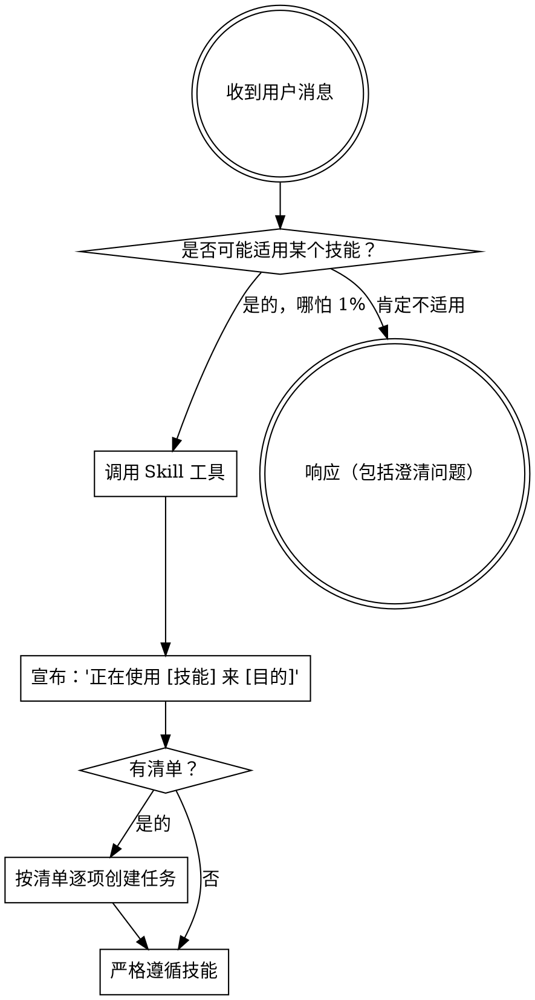

<SUBAGENT-STOP>
如果作为子代理被派发执行特定任务，跳过此技能。
</SUBAGENT-STOP>

<EXTREMELY_IMPORTANT>
如果你认为有哪怕 1% 的可能性某个技能适用于你正在做的事情，你必须调用该技能。

如果技能适用于你的任务，你没有选择。你必须使用它。

这不是可商量的。这不是可选的。你不能合理化绕过它。
</EXTREMELY_IMPORTANT>

## 指令优先级

Fuxian 技能覆盖默认系统提示行为，但 **用户指令始终优先**：

1. **用户的明确指令**（CLAUDE.md, 直接请求）— 最高优先级
2. **Fuxian 技能** — 在冲突时覆盖默认系统行为
3. **默认系统提示** — 最低优先级

如果 CLAUDE.md 说"不要用 TDD"而技能说"始终用 TDD"，遵循用户指令。用户拥有最终控制权。

## 如何访问技能

**在 Claude Code 中：** 使用 `Skill` 工具。调用技能后，其内容会被加载并呈现给你——直接遵循。不要用 Read 工具读取技能文件。

**在 opencode 中：** 使用原生 `skill` 工具。技能从已安装的插件中自动发现。

## 平台适配

技能使用 Claude Code 工具名称。opencode 用户请参考 `references/opencode-tools.md` 获取工具等价物。

# 使用技能

## 规则

**在任何响应或行动之前，先调用相关或请求的技能。** 哪怕只有 1% 的可能性技能适用，也应该调用技能来确认。如果调用的技能不适用于当前情况，你不需要使用它。

## 红灯信号

这些想法意味着你应该停下来——你在合理化：

| 想法 | 现实 |
|------|------|
| "这只是个简单的问题" | 问题也是任务。检查技能。 |
| "我需要先了解更多上下文" | 技能检查先于澄清问题。 |
| "让我先探索一下代码库" | 技能告诉你如何探索。先检查。 |
| "我可以快速检查 git/文件" | 文件缺少对话上下文。检查技能。 |
| "让我先收集信息" | 技能告诉你如何收集信息。 |
| "这不需要正式的技能" | 如果技能存在，就使用它。 |
| "我记得这个技能" | 技能会演进。读取当前版本。 |
| "这不算是任务" | 行动 = 任务。检查技能。 |
| "技能太重了" | 简单的事情也会变复杂。使用它。 |
| "我就先做这一件事" | 在做任何事之前先检查。 |
| "这感觉很有效率" | 不守纪律的行动是浪费时间。技能能防止这种情况。 |
| "我知道那是什么意思" | 知道概念 ≠ 使用技能。调用它。 |

## 技能优先级

当多个技能可能适用时，按此顺序使用：

1. **流程技能优先**（task-context, brainstorming, debugging）— 这些决定如何处理任务
2. **实现技能其次**（test-driven-development 等）— 这些指导执行

"实现 X 功能" → 先 task-context，再 brainstorming，然后实现技能。
"修复这个 bug" → 先 debugging，然后领域特定技能。
"新增 Y 能力" → 先 task-context，再 brainstorming，然后实现技能。

## 技能类型

**严格型**（TDD, debugging）：严格遵循。不要适应性地偏离纪律。

**灵活型**（task-context, patterns）：根据上下文调整原则。对于非常简单的任务，task-context 可以快速确认后跳过，但不能完全跳过。

技能本身会告诉你它是哪种类型。

## 用户指令

指令说的是做什么，不是怎么做。"添加 X" 或 "修复 Y" 不意味着跳过工作流。
